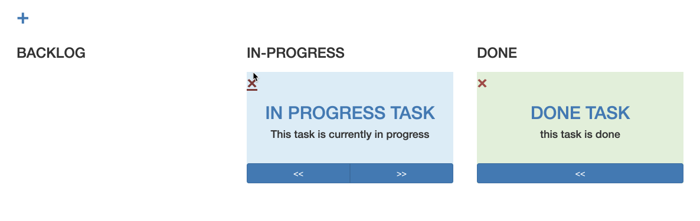

# **TODO APP**
>Todo app is used for creating tasks for the user. Each todo status are categorized by the following: backlog, in progress and done.

## **ERD**

____
# **App Process - End users**
## *Register*
•To use this app you need to register first, please remember your password as this version doesn't support password edit.

•Username must be unique from existing usernames. 
    
## *Login* 
• There are two processes in logging in, inputting your username first then the password.

• The first process checks if the username used exist in the database if not it will redirect back to the username input.

• The last process checks if the password matches the username's password. Upon succesful checking the user is redirected to the user view. If the passwords doesn't it will redirect back to the password input.

## *Add Todo*
• The user can add tasks by clicking the plus icon

• Then the user will be asked for the title and description of the task.

• Newly added tasks gets the backlog status.

## *Todo Status*
• Backlog - tasks that are currently on standby.

• In Progress - tasks that are currently in progress

• Done - tasks that are done.

• Update status by clicking on the arrow at the bottom of each todo card.

## *Edit Todo*
• The app lets you edit your todo  by clicking on the title of the app

##  *Delete Todo*
• Delete todo by clicking the X mark on each todo card.

